<p align="center">
  
</p>

<h1 align="center">
  <a href="https://mindustry-tool.com">Mindustry Tool</a>
</h1>

<p align="center">
  <strong>The Ultimate In-Game Utility for Mindustry Players</strong>
</p>

<p align="center">
  <a href="https://github.com/MindustryVN/MindustryToolMod/releases">
    
  </a>
  <a href="https://github.com/MindustryVN/MindustryToolMod/releases">
    
  </a>
  <a href="https://discord.gg/nQDrEHVkrt">
    
  </a>
  
</p>

<p align="center">
  
  
  
  
</p>

<p align="center">
  <a href="#-features">Features</a> •
  <a href="#-screenshots">Screenshots</a> •
  <a href="#-installation">Installation</a> •
  <a href="#-playerconnect">PlayerConnect</a> •
  <a href="#-faq">FAQ</a> •
  <a href="#-community">Community</a>
</p>

---

## 📖 About

**Mindustry Tool** is a comprehensive Mod as a service that integrates with [mindustry-tool.com](https://mindustry-tool.com), transforming your Mindustry experience. Browse thousands of curated **maps** and **schematics**, host multiplayer servers without port forwarding, and connect with a global community of players.

<p align="center">
  
  
  
  
</p>

---

## 📊 Stats

<!-- Stats are automatically updated daily by GitHub Actions -->
<p align="center">
  
  
  
  
</p>

---

## ⚡ Quick Start

```bash
# 1. In Mindustry: Mods → Import from GitHub
MindustryVN/MindustryToolMod

# 2. Restart the game

# 3. Click "Tools" in main menu → Start browsing!
```

| Step | Action |
|------|--------|
| 1️⃣ | Open Mindustry → **Mods** → **Import from GitHub** |
| 2️⃣ | Enter `MindustryVN/MindustryToolMod` → Click **OK** |
| 3️⃣ | Restart game → Click **Tools** in main menu |
| 🎉 | Browse maps, schematics, and play with friends! |

---

## 🏗️ Architecture

```mermaid
graph TB
    subgraph Game["🎮 Mindustry Game"]
        MOD["Mindustry Tool Mod"]
    end
    
    subgraph Features["✨ Core Features"]
        MB["🗺️ Map Browser"]
        SB["📐 Schematic Browser"]
        PC["🎮 PlayerConnect"]
        FB["🔍 Filter System"]
    end
    
    subgraph External["☁️ Cloud Services"]
        API["🌐 API Server<br/>api.mindustry-tool.com"]
        CDN["🖼️ Image CDN<br/>image.mindustry-tool.com"]
        RELAY["📡 Relay Servers<br/>Global Network"]
    end
    
    MOD --> MB & SB & PC & FB
    MB & SB --> API
    MB & SB --> CDN
    PC --> RELAY
    
    style Game fill:#1a1a2e,stroke:#16213e,color:#fff
    style Features fill:#0f3460,stroke:#16213e,color:#fff
    style External fill:#533483,stroke:#16213e,color:#fff
```



---

## ✨ Features


### 🗺️ Map Browser
Browse, search, and download maps directly in-game with powerful filtering options.

- **Advanced Search** - Filter by game mode, planet, size, threat level, and more
- **Instant Download** - One-click download and play
- **Quality Curated** - All content reviewed by moderators

### 📐 Schematic Browser
Access thousands of community schematics for any situation.

- **Smart Categories** - Filter by resources, factories, defense, units, and more
- **Copy or Download** - Use instantly or save for later
- **Detailed Preview** - See requirements before downloading

### 🎮 PlayerConnect
**Host multiplayer servers without port forwarding!**

```mermaid
sequenceDiagram
    participant H as 🎮 Host
    participant R as 📡 Relay Server
    participant C as 👥 Clients
    
    H->>R: Create Room
    R-->>H: Room ID + Link
    H->>C: Share Link
    C->>R: Join Request
    R->>H: Forward Connection
    H-->>C: Connected!
    
    Note over H,C: 🎉 Play Together!
```



- **One-Click Hosting** - Create a room and share the link
- **Global Relay Servers** - Optimized for low latency worldwide
- **Room Browser** - Find and join active games easily
- **Password Protection** - Keep your games private

### 🌍 35+ Languages
Full localization support including English, Tiếng Việt, 中文, 한국어, 日本語, Русский, Deutsch, Français, Español, and [many more](#-supported-languages)!

---

## 📸 Screenshots

<details>
<summary>🗺️ Map Browser</summary>
<p align="center">
  <em>Browse thousands of community maps with advanced filtering</em>
  <!-- Add actual screenshot:  -->
  <br><br>
  📷 <strong>Screenshot coming soon!</strong>
</p>
</details>

<details>
<summary>📐 Schematic Browser</summary>
<p align="center">
  <em>Find the perfect schematic for any situation</em>
  <!-- Add actual screenshot:  -->
  <br><br>
  📷 <strong>Screenshot coming soon!</strong>
</p>
</details>

<details>
<summary>🎮 PlayerConnect</summary>
<p align="center">
  <em>Host and join multiplayer games with ease</em>
  <!-- Add actual screenshot:  -->
  <br><br>
  📷 <strong>Screenshot coming soon!</strong>
</p>
</details>

<details>
<summary>🔍 Filter System</summary>
<p align="center">
  <em>Powerful tag-based filtering for precise content discovery</em>
  <!-- Add actual screenshot:  -->
  <br><br>
  📷 <strong>Screenshot coming soon!</strong>
</p>
</details>

---

## 📥 Installation

### Method 1: In-Game Import (Recommended)
1. Open Mindustry → **Mods** → **Import from GitHub**
2. Enter: `MindustryVN/MindustryToolMod`
3. Click **OK** and restart the game

### Method 2: Manual Installation
1. Download the latest release from [Releases](https://github.com/MindustryVN/MindustryToolMod/releases)
2. Move the `.jar` file to your Mindustry mods folder:

| Platform | Mods Folder Location |
|----------|---------------------|
| **Windows** | `%AppData%/Mindustry/mods/` |
| **Linux** | `~/.local/share/Mindustry/mods/` |
| **macOS** | `~/Library/Application Support/Mindustry/mods/` |
| **Android** | `Android/data/io.anuke.mindustry/files/mods/` |
| **Steam** | `Steam/steamapps/common/Mindustry/saves/mods/` |

3. Restart Mindustry

---

## 🎮 PlayerConnect

PlayerConnect allows you to play with friends without complex network setup.

### How to Host
1. Start a local game in Mindustry
2. Open **Player Connect** from the main menu
3. Click **Create Room** and select a relay server
4. Share the generated link with friends

### How to Join
1. Open **Player Connect** → **Join via Link**
2. Paste the room link
3. Click **Connect**

> **💡 Tip:** For best performance, choose a relay server closest to your region.

---

## 📋 Compatibility

| Mindustry Version | Mod Version | Status |
|-------------------|-------------|--------|
| **v146+** | v1.16.x | ✅ Fully Supported |
| v145 | v1.15.x | ⚠️ Limited Support |
| v144 and below | - | ❌ Not Supported |

---

## ❓ FAQ

<details>
<summary><strong>Does the mod work on mobile?</strong></summary>
<br>
Yes! Mindustry Tool fully supports Android devices. The UI automatically adapts for touch controls.
</details>

<details>
<summary><strong>Why can't I connect to PlayerConnect?</strong></summary>
<br>

- Ensure your game version is **v146 or higher**
- Try selecting a different relay server
- Check if the room link is still valid (rooms close when the host leaves)
- Verify your internet connection
</details>

<details>
<summary><strong>How do I upload my maps/schematics?</strong></summary>
<br>
Visit <a href="https://mindustry-tool.com">mindustry-tool.com</a> to upload content. All submissions are reviewed by moderators for quality.
</details>

<details>
<summary><strong>Is the mod safe to use?</strong></summary>
<br>
Yes! The mod is open-source, and all content on the platform is moderated for safety and quality.
</details>

<details>
<summary><strong>How do I update the mod?</strong></summary>
<br>
The mod will notify you automatically when a new version is available. Simply click "Update" or reinstall from GitHub.
</details>

---

## 🌐 Supported Languages

| Language | Code | Status |
|----------|------|--------|
| 🇺🇸 English | `en` | ✅ Complete |
| 🇻🇳 Tiếng Việt | `vi` | ✅ Complete |
| 🇨🇳 简体中文 | `zh_CN` | ✅ Complete |
| 🇹🇼 繁體中文 | `zh_TW` | ✅ Complete |
| 🇰🇷 한국어 | `ko` | ✅ Complete |
| 🇯🇵 日本語 | `ja` | ✅ Complete |
| 🇷🇺 Русский | `ru` | ✅ Complete |
| 🇺🇦 Українська | `uk_UA` | ✅ Complete |
| 🇧🇾 Беларуская | `be` | ✅ Complete |
| 🇧🇬 Български | `bg` | ✅ Complete |
| 🇩🇪 Deutsch | `de` | ✅ Complete |
| 🇫🇷 Français | `fr` | ✅ Complete |
| 🇪🇸 Español | `es` | ✅ Complete |
| 🇵🇹 Português (BR) | `pt_BR` | ✅ Complete |
| 🇵🇹 Português (PT) | `pt_PT` | ✅ Complete |
| 🇮🇹 Italiano | `it` | ✅ Complete |
| 🇳🇱 Nederlands | `nl` | ✅ Complete |
| 🇵🇱 Polski | `pl` | ✅ Complete |
| 🇹🇷 Türkçe | `tr` | ✅ Complete |
| 🇹🇭 ไทย | `th` | ✅ Complete |
| 🇮🇩 Bahasa Indonesia | `id` | ✅ Complete |
| 🇵🇭 Filipino | `fil` | ✅ Complete |
| 🇨🇿 Čeština | `cs` | ✅ Complete |
| 🇩🇰 Dansk | `da` | ✅ Complete |
| 🇫🇮 Suomi | `fi` | ✅ Complete |
| 🇭🇺 Magyar | `hu` | ✅ Complete |
| 🇱🇹 Lietuvių | `lt` | ✅ Complete |
| 🇷🇴 Română | `ro` | ✅ Complete |
| 🇷🇸 Srpski | `sr` | ✅ Complete |
| 🇸🇪 Svenska | `sv` | ✅ Complete |
| 🇪🇪 Eesti | `et` | ✅ Complete |
| 🇪🇸 Euskara | `eu` | ✅ Complete |
| 🇪🇸 Català | `ca` | ✅ Complete |
| 🇹🇲 Türkmen | `tk` | ✅ Complete |

---

## 🗺️ Roadmap

- [x] 35+ languages support
- [x] PlayerConnect multiplayer relay
- [x] Advanced tag-based filtering
- [x] Auto-update notifications
- [ ] In-game content rating system
- [ ] Favorite schematics/maps sync
- [ ] Tournament mode for PlayerConnect
- [ ] Server-side plugins support
- [ ] Real-time room chat
---

## ⭐ Star History

<p align="center">
  <a href="https://star-history.com/#MindustryVN/MindustryToolMod&Date">
    
  </a>
</p>

## 📝 Changelog


### v1.16.17 (Latest)
- 🐛 Bug fixes and stability improvements
- 🌍 Updated translations

### v1.16.x
- ✨ Added new filter categories
- 🎮 Improved PlayerConnect stability
- 🌍 Added 10+ new languages
- 🔧 Performance optimizations

> See [Releases](https://github.com/MindustryVN/MindustryToolMod/releases) for full changelog.

---

## 🔧 Building from Source

```bash
# Clone the repository
git clone https://github.com/MindustryVN/MindustryToolMod.git
cd MindustryToolMod

# Build for Desktop only
./gradlew jar

# Build for Desktop + Android (requires Android SDK)
./gradlew deploy
```

**Output:** `build/libs/MindustryToolMod.jar`

### Requirements
- Java Development Kit (JDK) 16+
- Android SDK (optional, for Android builds)

---

## 🔗 API & Resources

| Resource | URL |
|----------|-----|
| **Website** | [mindustry-tool.com](https://mindustry-tool.com) |
| **API Endpoint** | `https://api.mindustry-tool.com/api/v4/` |
| **Image CDN** | `https://image.mindustry-tool.com/` |

---

## 🤝 Contributing

Contributions are welcome! Here's how you can help:

### Code Contributions
1. Fork the repository
2. Create your feature branch (`git checkout -b feature/AmazingFeature`)
3. Commit your changes (`git commit -m 'Add some AmazingFeature'`)
4. Push to the branch (`git push origin feature/AmazingFeature`)
5. Open a Pull Request

### Translation Contributions
1. Edit files in `assets/bundles/`
2. Follow the format of existing translations
3. Submit a Pull Request

> **Need help?** Join our [Discord](https://discord.gg/nQDrEHVkrt) for support!

---

## 🤝 Community

<p align="center">
  <a href="https://mindustry-tool.com">
    
  </a>
  <a href="https://discord.gg/nQDrEHVkrt">
    
  </a>
  <a href="https://www.reddit.com/r/MindustryTool">
    
  </a>
  <a href="https://www.youtube.com/@MindustryTool">
    
  </a>
</p>

### 🤝 Community Partners

| Community | Links |
|-----------|-------|
| **Design-it Community** | [Discord](https://discord.gg/SYVkWPhmXY) • [GitHub](https://github.com/MindustryDesignIt) |
| **Mindustry Top** | [Website](https://www.mindustry.top) • [Email](mailto:me@wayzer.top) |

---

## 👏 Credits

This section compiles and acknowledges the main sources of schematics, maps, and logic scripts that have been shared within the Mindustry community. We honor the creators, repositories, and communities who have contributed these valuable resources, enriching the experience for players, modders, and server owners alike.

> **💖 We extend our heartfelt thanks to everyone who has shared, maintained, and spread these resources. Your contributions have helped build a creative, diverse, and lasting Mindustry community.**

---

### 🛠️ Core Team

| Avatar | Name | Role |
|--------|------|------|
|  | **[Sharlotte](https://github.com/MindustryVN)** | Lead Developer |

### ⭐ Special Thanks

| Avatar | Name | Contribution |
|--------|------|-------------|
|  | **[xpdustry](https://github.com/xpdustry)** | CLaJ (PlayerConnect relay) technology |
|  | **[Anuken](https://github.com/Anuken)** | Creator of Mindustry |

### 👥 Contributors

<p align="center">
  <a href="https://github.com/MindustryVN/MindustryToolMod/graphs/contributors">
    
  </a>
</p>

<p align="center">
  <em>Thank you to all our amazing contributors! 🎉</em>
</p>

> **Want to contribute?** Check out our [Contributing Guide](#-contributing) or join our [Discord](https://discord.gg/nQDrEHVkrt)!

---

### 🏗️ Schematics Credits

> **📌 Main Source:** [MindustryDesignIt/design-it](https://github.com/MindustryDesignIt/design-it) *(Updates automatically)*
> 
> **Note:** Remember to backup and update your local repo by fetch! Other repos may not be maintained by designers - **please check the repo first and do your own risk!**
> 
> Discuss, feedback, and request for updates: [Design-It Discord](https://discord.gg/SYVkWPhmXY)

<details>
<summary><strong>📦 Schematics Dumps</strong> (May contain large number of schematics!)</summary>

| Repository | Notes |
|------------|-------|
| [MinRi2/schematics-archives](https://github.com/MinRi2/schematics-archives) | Chinese schematics archives, updates automatically |
| [TudRVN/tudr-s-schempack](https://github.com/TudRVN/tudr-s-schempack) | |
| [Yo0o0o/schemdump](https://github.com/Yo0o0o/schemdump) | |
| [EvarystGalua/schemdump](https://github.com/EvarystGalua/schemdump) | |
| [JasonP01/community-schematics](https://github.com/JasonP01/community-schematics) | Official Mindustry's #schematics and #curated-schematics channels, updates automatically |
| [foxitOS/CMD-pack](https://github.com/foxitOS/CMD-pack) | |
| [FallenDraggon/FDSchemePack](https://github.com/FallenDraggon/FDSchemePack) | |

</details>

<details>
<summary><strong>📚 Schematics Series</strong> (Collections focused on specific mechanics)</summary>

| Repository | Focus |
|------------|-------|
| [ShatteredSkies/mindustry-mass-driver-logic](https://github.com/ShatteredSkies/mindustry-mass-driver-logic) | Mass Driver Logic |
| [lordDev01/mindustry-upgrade-controllers](https://github.com/lordDev01/mindustry-upgrade-controllers) | Upgrade Controllers |
| [BigSpeck/modular-interchangeable-coremounts](https://github.com/BigSpeck/modular-interchangeable-coremounts) | Core Mounts |
| [holmes-g/yamai](https://github.com/holmes-g/yamai) | YAMAI |

</details>

<details>
<summary><strong>🗂️ Schematics Libraries</strong> (General-purpose libraries, mixed categories)</summary>

| Repository |
|------------|
| [araneogit/mindyara](https://github.com/araneogit/mindyara) |
| [H15-H/mindustry-schematics](https://github.com/H15-H/mindustry-schematics) |
| [cthu1huDaGreat/Mindustry-Schematics](https://github.com/cthu1huDaGreat/Mindustry-Schematics) |
| [SomeonesShade/Shades-Mindustry-SchemLibrary](https://github.com/SomeonesShade/Shades-Mindustry-SchemLibrary) |
| [Hexrotor/Mindustry-Myblueprint](https://github.com/Hexrotor/Mindustry-Myblueprint) |
| [holmes-g/schematics](https://github.com/holmes-g/schematics) |
| [holmes-g/mixtech-schematics](https://github.com/holmes-g/mixtech-schematics) |
| [holmes-g/logic-schematics](https://github.com/holmes-g/logic-schematics) |

</details>

<details>
<summary><strong>🎮 Schematics for Game Modes</strong> (Specialized packs for custom modes)</summary>

| Repository | Game Mode |
|------------|-----------|
| [Apricot-Conservation-Project/schems](https://github.com/Apricot-Conservation-Project/schems) | Plague (updates automatically) |
| [bend-n/evict](https://github.com/bend-n/evict) | Evict |
| [yaaty256/flood](https://github.com/yaaty256/flood) | .io Flood |
| [yaaty256/td](https://github.com/yaaty256/td) | .io Tower Defense |
| [holmes-g/flood-schematics](https://github.com/holmes-g/flood-schematics) | .io Flood |

</details>

<details>
<summary><strong>🗑️ Schematics Others</strong> (Outdated / Test Repos)</summary>

| Repository | Status |
|------------|--------|
| [eeve-lyn/curated-schematics](https://github.com/eeve-lyn/curated-schematics) | Archived |
| [eeve-lyn/schematics](https://github.com/eeve-lyn/schematics) | Archived |
| [MindustryDesignIt/main](https://github.com/MindustryDesignIt/main) | Legacy |
| [bend-n/design-it](https://github.com/bend-n/design-it) | Legacy |
| [bend-n/apple](https://github.com/bend-n/apple) | Test |

</details>

---

### ⚙️ Mindustry Logic Scripts

*Logic written in mlog, useful for advanced scripting (not .msch files!)*

| Repository | Description |
|------------|-------------|
| [sbxte/LogiDustry](https://github.com/sbxte/LogiDustry) | LogiDustry Collection |
| [BalaM314/mlog](https://github.com/BalaM314/mlog) | Mlog Scripts |
| [SomeonesShade/Mindustry---Mlog](https://github.com/SomeonesShade/Mindustry---Mlog) | Mlog Collection |
| [Gewi413/mindustry-logic](https://github.com/Gewi413/mindustry-logic) | Logic Scripts |

---

### 🗺️ Map Credits

#### 🌍 Community Map Sources

| Source | Type |
|--------|------|
| [Mindustry.top](https://www.mindustry.top) | Website |
| Chaotic Neutral | Discord Server |

#### 🌌 Map Mods

| Mod | Description |
|-----|-------------|
| New Horizon | Custom planet maps |
| Asthusus | Modded maps |

---

### 🌍 Translators

A huge thank you to our amazing translators!

| Language | Translator | Contact |
|----------|------------|---------|
| 🇻🇳 Tiếng Việt | [@junghamin1909](https://github.com/junghamin1909) | carrot_eo |
| 🇨🇳 中文 | [@LaoHuaJiOfficial](https://github.com/LaoHuaJiOfficial) | lao_hua_ji |
| 🇺🇦 Українська | - | cergc |
| 🇰🇷 한국어 | - | teong_geuri |
| 🇧🇾 Беларуская | - | 4sterc4rd9102 |

> **Want to contribute a translation?** Join our [Discord](https://discord.gg/nQDrEHVkrt) and let us know!

---

## ⚠️ Known Issues

| Issue | Status | Workaround |
|-------|--------|------------|
| PlayerConnect may timeout on slow connections | 🔄 Investigating | Try a different relay server |
| Some old schematics may not load on v146+ | ⚠️ Known | Re-export schematic in newer version |
| Large schematic previews may lag on mobile | 🔄 Optimizing | Reduce schematic complexity |

> **Found a bug?** [Open an issue](https://github.com/MindustryVN/MindustryToolMod/issues) or report in [Discord](https://discord.gg/nQDrEHVkrt)

---

## 💖 Support the Project

<p align="center">
  If you find this mod helpful, consider supporting the development!
</p>

<p align="center">
  <a href="https://github.com/MindustryVN/MindustryToolMod">
    
  </a>
  <a href="https://discord.gg/nQDrEHVkrt">
    
  </a>
</p>

---

## 🔗 Related Projects

| Project | Description |
|---------|-------------|
| [mindustry-tool.com](https://mindustry-tool.com) | 🌐 Official website for browsing maps & schematics |
| [MindustryDesignIt](https://github.com/MindustryDesignIt) | 🎨 Design-It community schematics |
| [Mindustry.top](https://mindustry.top) | 🗺️ Map sharing platform |

---

## 🛠️ Tech Stack

<p align="center">
  
  
  
  
</p>

---

## 📄 License

This project is licensed under the MIT License - see the [LICENSE](LICENSE) file for details.

---

<p align="center">
  <strong>⭐ If you enjoy this mod, please give it a star! ⭐</strong>
</p>

<p align="center">
  
  
  
</p>

<p align="center">
  Made with ❤️ by the Mindustry Tool team
</p>
